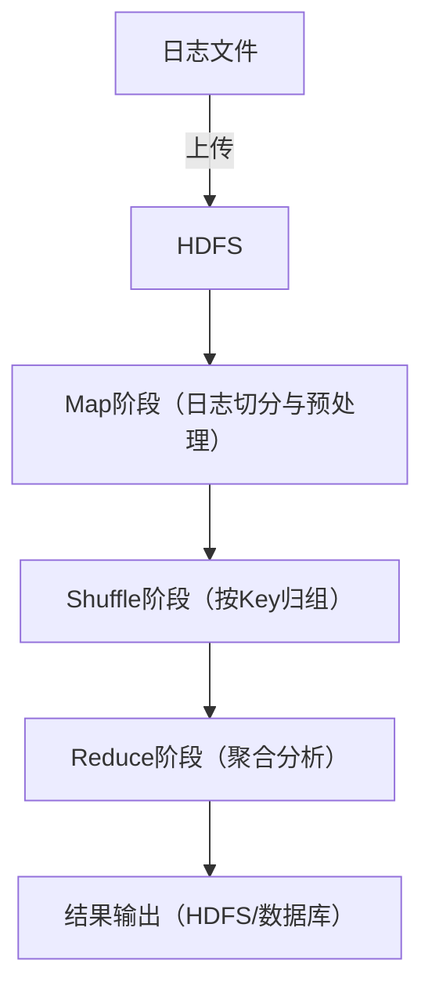

## 基于MapReduce的分布式日志分析系统学习与设计

## 代码都在分支里，请下载或预览使用

## 一、学习内容

- **MapReduce原理**
  - MapReduce编程模型（Map、Shuffle、Reduce阶段）
  - Hadoop生态系统（HDFS、YARN等）
  - 数据分片与任务调度机制
- **日志分析基础**
  - 日志格式（如Apache/Nginx日志、应用日志等）
  - 常见分析需求（访问量统计、异常检测、用户行为分析等）
- **分布式系统基础**
  - 节点通信与容错
  - 数据一致性与高可用
- **案例学习**
  - 典型的开源日志分析平台（如ELK、Hadoop Streaming）

## 二、系统设计思路

### 1. 需求分析
- 支持哪些类型的日志
- 处理哪些分析任务（如PV/UV、错误统计、流量峰值检测等）
- 实时性要求（批处理、准实时、实时）

### 2. 系统架构


### 3. MapReduce任务设计
- **Map函数**：解析日志，提取分析字段（如IP、时间、状态码等），输出Key-Value对  
  例：统计IP访问量，Map输出：`<IP, 1>`
- **Reduce函数**：对相同Key进行合并、聚合  
  例：对每个IP的访问量求和

### 4. 部署与运行
- 日志上传至HDFS
- 提交MapReduce作业（可用Hadoop Streaming支持多语言）
- 结果存入HDFS或导入数据库

### 5. 性能优化
- 合理设置Map/Reduce数量
- 数据本地化，减少网络IO
- 采用Combiner减少中间数据

## 三、可参考的系统实现流程
- 日志数据采集，上传到HDFS
- 编写MapReduce程序（Java/Python）
- 提交作业，监控运行
- 分析结果输出，进行可视化展示（如用Tableau、Grafana等）


## 3.1 日志数据模型
定义标准化的日志数据模型，支持多种日志格式：

```java
public class LogRecord {
    private String timestamp;      // 时间戳
    private String level;          // 日志级别
    private String source;         // 日志源
    private String message;        // 日志内容
    private String userId;         // 用户ID
    private String sessionId;      // 会话ID
    private Map<String, String> attributes; // 扩展属性
}
```

## 3.2 MapReduce算法实现

### 3.2.1 日志统计分析

**Mapper实现：**

```java
public class LogAnalysisMapper extends Mapper<LongWritable, Text, Text, IntWritable> {
    private Text outputKey = new Text();
    private IntWritable outputValue = new IntWritable(1);
    
    @Override
    protected void map(LongWritable key, Text value, Context context) 
            throws IOException, InterruptedException {
        String logLine = value.toString();
        LogRecord record = parseLogRecord(logLine);
        
        // 按小时统计访问量
        String hour = extractHour(record.getTimestamp());
        outputKey.set(hour);
        context.write(outputKey, outputValue);
    }
}
```

**Reducer实现：**

```java
public class LogAnalysisReducer extends Reducer<Text, IntWritable, Text, IntWritable> {
    private IntWritable result = new IntWritable();
    
    @Override
    protected void reduce(Text key, Iterable<IntWritable> values, Context context)
            throws IOException, InterruptedException {
        int sum = 0;
        for (IntWritable value : values) {
            sum += value.get();
        }
        result.set(sum);
        context.write(key, result);
    }
}
```

### 3.2.2 异常检测分析
实现基于规则的异常日志检测算法：

```java
public class AnomalyDetectionMapper extends Mapper<LongWritable, Text, Text, Text> {
    private Pattern errorPattern = Pattern.compile("ERROR|EXCEPTION|FATAL");
    
    @Override
    protected void map(LongWritable key, Text value, Context context)
            throws IOException, InterruptedException {
        String logLine = value.toString();
        
        if (errorPattern.matcher(logLine).find()) {
            String timestamp = extractTimestamp(logLine);
            context.write(new Text(timestamp), new Text(logLine));
        }
    }
}
```

## 3.3 性能优化策略

### 3.3.1 数据本地性优化
数据本地性是提升分布式计算性能的关键因素之一。为有效提高计算过程中数据的本地性，本系统采取以下措施：

- **一致性哈希算法进行数据分片**：采用一致性哈希算法作为数据分布策略，可以确保数据在集群中的均匀分配。这种方法通过维护较小的缓存和较低的重分布成本，使得节点之间的数据分布更加均衡，有效减少了数据在网络中的传输需求，为后续的计算过程提供了更高的本地性。

- **优化Map任务的调度策略**：在调度Map任务时，系统优先选择数据本地节点进行计算。这一策略的实施，可以显著减少因数据迁移而引起的延迟，提升计算任务的响应速度。

### 3.3.2 内存优化
内存管理对于提升分布式计算的整体性能同样至关重要。为此，本系统实施了以下内存优化措施：

- **调整JVM堆内存配置**：通过合理配置Java虚拟机（JVM）的堆内存，避免频繁的垃圾回收。合适的内存配置可以减少GC的频率，从而降低系统的停顿时间，提升处理效率。

- **使用Combiner减少网络传输数据量**：在MapReduce框架中，使用Combiner可以有效降低网络传输过程中需要传输的数据量。

- **优化数据序列化和反序列化性能**：选择高效的序列化框架，如Kryo或Avro，能够降低数据序列化和反序列化的时间消耗，从而提高整体的数据处理速度。

### 3.3.3 I/O优化
I/O性能对分布式系统的处理能力有直接影响，因此，在I/O方面的优化措施同样不可忽视：

- **采用压缩算法减少磁盘存储空间**：在存储大规模日志数据时，压缩算法的使用能够显著减少所需的磁盘空间。这不仅降低存储成本，还加快了磁盘读取速度，提高了数据的访问效率。

- **优化HDFS的块大小配置**：适应性调整Hadoop分布式文件系统（HDFS）的块大小是优化I/O性能的有效手段。较大的块大小可以减少Map任务的启动次数，提高数据的读取效率。

- **使用固态硬盘（SSD）存储提升I/O性能**：通过将日志数据存储在SSD设备中，系统可以显著提高数据的读取和写入速度，为实时日志分析提供更为迅捷的存储支持。
```
